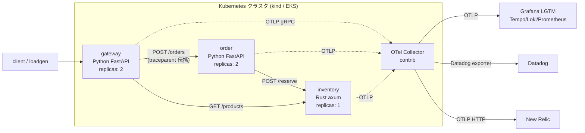
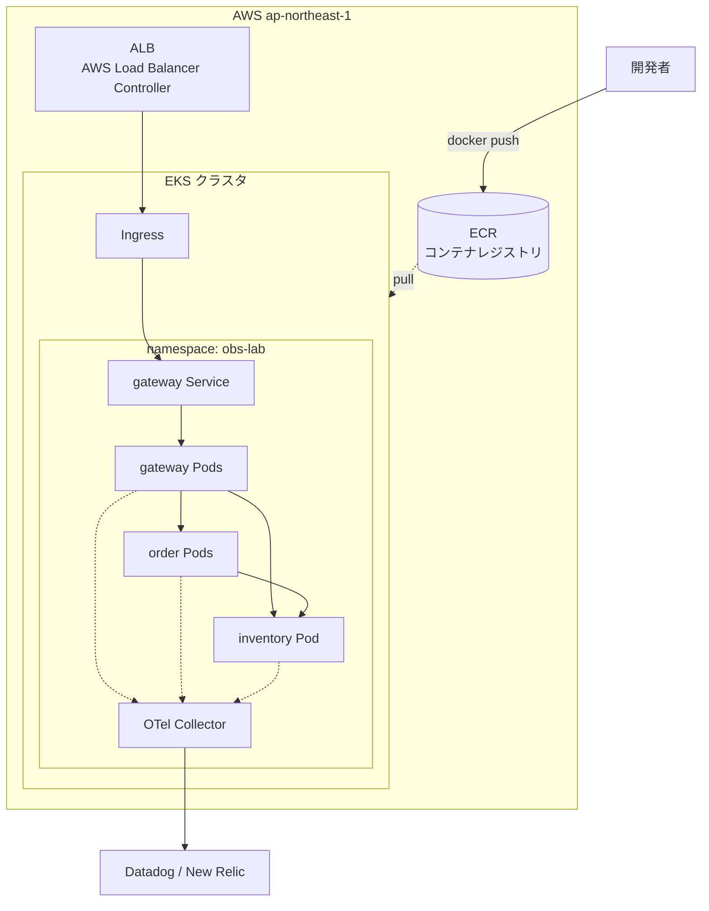

# システム構成と技術選定

## 全体像

実線 = 業務トラフィック、点線 = テレメトリ。

## なぜこの構成か

### サービス分割 (gateway / order / inventory)

マイクロサービスの教科書的パターンを最小構成で再現しています。

- **gateway**: BFF / API Gateway 層。外部公開はここだけ。認証・集約・変換を担う層の代役
- **order**: ビジネスロジックを持つサービス。他サービスへの依存 (在庫引き当て) があり、
  「自分は正常でも依存先で壊れる」というマイクロサービス特有の障害モードを体験できる
- **inventory**: 状態 (在庫) を持つサービス。Rust 製にすることで
  「分散トレースは言語をまたいで繋がる」ことを実感できる

3つが最小です。2つだと「伝播」が1ホップで自明、4つ以上は学習コストだけ増えます。

### 同期 HTTP のみにした理由

実務のマイクロサービスでは SQS/Kafka などの非同期メッセージングが重要ですが、
非同期のトレース伝播 (span link 等) は難易度が一段上がるため、
まず同期 HTTP でトレースの基礎を固める構成にしました。
次のステップとして order → 発送通知を SQS 化する拡張がおすすめです (roadmap 参照)。

### OpenTelemetry + Collector を挟む理由

2026年現在、**計装 (アプリ側) はベンダー中立の OpenTelemetry で統一し、
バックエンドだけ選ぶ**のが業界標準のアプローチです。

- Datadog Agent や New Relic Agent を直接入れると、ベンダー乗り換え時に
  全サービスの再計装が必要になる (ベンダーロックイン)
- Collector を挟めば、送り先の変更は **Collector の設定ファイル1枚**で済む。
  このリポジトリでは compose / kind / EKS すべてで実際にそうなっている
- Datadog も New Relic も OTLP/OTel データの受け入れを公式サポートしている

Collector の設定 (receivers → processors → exporters のパイプライン) を
読み書きできることが、2026年の Observability エンジニアリングの基礎体力です。

### Collector のデプロイパターン

このリポジトリでは学習用に **Gateway パターン** (Deployment 1つに集約) を採用。
本番では以下も検討します:

- **DaemonSet (Agent) パターン**: 各ノードに Collector を置き、ノードローカルで受ける。
  ホストメトリクスやログファイル収集も担える
- **Sidecar パターン**: Pod ごとに Collector。分離は強いがリソース効率が悪い
- **Agent + Gateway 二段構成**: 大規模での定番。ノード側で受けて中央でサンプリング等を実施

### Python + Rust の混在

- Python (FastAPI): 自動計装が成熟しており、`FastAPIInstrumentor` を1行呼ぶだけで
  HTTP サーバー/クライアントのスパンが取れる。書き慣れた言語で OTel の概念に集中できる
- Rust (axum): `tracing` クレートのエコシステムと OTel の統合を体験。
  トレースコンテキスト (traceparent ヘッダー) が言語非依存の W3C 標準であることを、
  Python→Rust をまたぐ1本のトレースで確認できる

### インメモリストアにした理由

DB を入れると初期構築の学習負荷が上がるため、意図的に外しました。
inventory を replicas: 1 にしているのはそのためで、
「これを2にすると何が壊れるか」を考えること自体が良い演習です
(答え: Pod ごとに在庫が分裂する → 外部ストア or StatefulSet 的設計が必要になる)。

## AWS 上の推奨構成 (EKS)

- **ノード**: 学習用なら Managed Node Group (t3.medium × 2) が最も扱いやすい。
  Fargate for EKS も動くが、DaemonSet が使えない等の制約があるので2周目以降に
- **公開**: 学習中は `kubectl port-forward` で十分。ALB を試すときだけ
  AWS Load Balancer Controller を導入
- **コスト最重要注意**: EKS はクラスタだけで約 $73/月 + ノード代。
  **使わない日は `eksctl delete cluster` で消す**のが学習用途の鉄則 (詳細: eks-migration.md)
